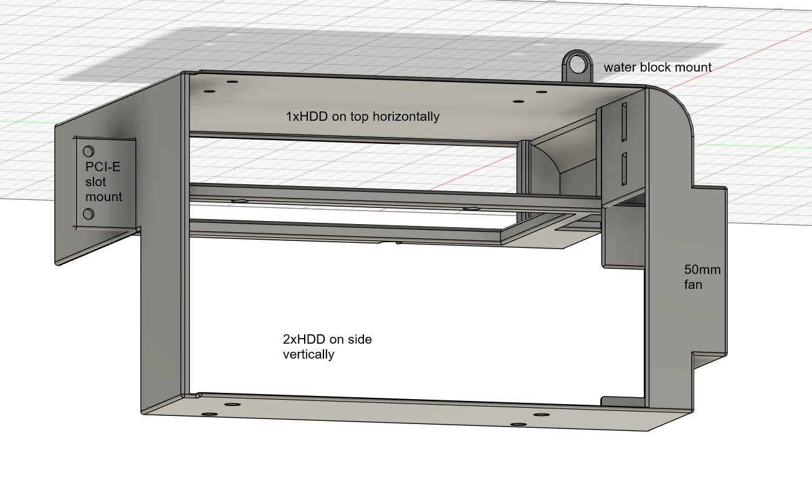

# PCI-E-Slot-3x3.5-HDD-Cage
Designed in Fusion 360
Fits 3x3.5"HDD + 50mm fan in a place for PCI-E slots. 
Takes 3 slots below GPU (the ones usually taken by M.2 SSD or chipset cooling anyway), other slots below remain usable as long as PCI-E card isnt too high. 
Mounted to two PCI-E slot mount holes + can be mounted to water block with additional screw if possible 
<b>Gpu thickness is limited to single slot or even less than a full slot.</b> 

Tested only with following components: 
Water block: Alphacool ES Geforce RTX 4090 Reference Design 
Motherboard: Asus ProArt X670E ProArt X670E-CREATOR WIFI 
Case: ENDORFY Ventum 200

Must be printed with supports.
Printing time: ~7h with 180mm/s speed
Material used: ~130g PLA (+70g for suports)

